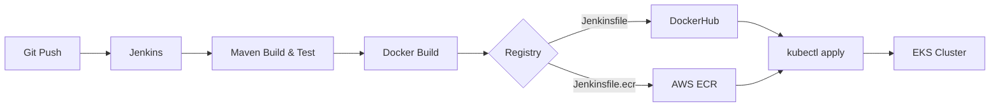

# Stage 5 — Jenkins CI/CD Pipeline to EKS

Complete CI/CD pipeline: build a Java Maven app, push Docker image to DockerHub or AWS ECR, and deploy to EKS.

## Pipeline Architecture



## Prerequisites

- EKS cluster running (from Stage 1 or 4)
- Jenkins server running in a Docker container
- DockerHub account (for Option A) or AWS ECR repository (for Option B)

## Jenkins Container Setup

### Install kubectl inside Jenkins

```bash
docker exec -it -u root jenkins-container bash

# Download kubectl
curl -LO "https://dl.k8s.io/release/$(curl -L -s https://dl.k8s.io/release/stable.txt)/bin/linux/amd64/kubectl"
chmod +x kubectl
mv kubectl /usr/local/bin/

# Verify
kubectl version --client
```

### Install aws-iam-authenticator

```bash
# Inside Jenkins container (as root)
curl -Lo aws-iam-authenticator https://github.com/kubernetes-sigs/aws-iam-authenticator/releases/download/v0.6.11/aws-iam-authenticator_0.6.11_linux_amd64
chmod +x aws-iam-authenticator
mv aws-iam-authenticator /usr/local/bin/
```

### Copy kubeconfig

```bash
# On your local machine, generate kubeconfig
aws eks update-kubeconfig --name my-eks-cluster --region eu-west-1

# Copy into Jenkins container
docker cp ~/.kube/config jenkins-container:/var/jenkins_home/.kube/config
```

### Install envsubst (for variable substitution in manifests)

```bash
# Inside Jenkins container (as root)
apt-get update && apt-get install -y gettext-base
```

## Option A — CI/CD with DockerHub

See [Jenkinsfile](./Jenkinsfile) for the full pipeline.

### Create DockerHub Secret in EKS

```bash
kubectl create secret docker-registry docker-hub-secret \
  --docker-server=https://index.docker.io/v1/ \
  --docker-username=<your-username> \
  --docker-password=<your-password> \
  --docker-email=<your-email>
```

### Jenkins Credentials

Add in Jenkins → Manage Credentials:
- **DockerHub**: Username/Password
- **AWS**: Secret text (Access Key ID + Secret Access Key)

## Option B — CI/CD with AWS ECR

See [Jenkinsfile.ecr](./Jenkinsfile.ecr) for the full pipeline.

### Create ECR Repository

```bash
aws ecr create-repository \
  --repository-name java-maven-app \
  --region eu-west-1
```

### Create ECR Secret in EKS

```bash
# Get ECR login token
aws ecr get-login-password --region eu-west-1 | \
  kubectl create secret docker-registry ecr-secret \
  --docker-server=<ACCOUNT_ID>.dkr.ecr.eu-west-1.amazonaws.com \
  --docker-username=AWS \
  --docker-password-stdin
```

See detailed setup guides:
- [Jenkins-EKS Setup](./docs/jenkins-eks-setup.md)
- [ECR Setup](./docs/ecr-setup.md)

## Key Takeaways

- Jenkins needs **kubectl + aws-iam-authenticator** to deploy to EKS
- `envsubst` replaces environment variables (like `$IMAGE_TAG`) in K8s manifest templates at deploy time
- **Best practice**: Create a dedicated AWS IAM user for Jenkins with limited permissions
- ECR is preferable in AWS environments (no rate limits, same IAM, lower latency)
- K8s Secrets (docker-registry type) allow the cluster to pull images from private registries

## References

- [EKS Cluster Authentication](https://docs.aws.amazon.com/eks/latest/userguide/managing-auth.html)
- [Create Kubeconfig](https://docs.aws.amazon.com/eks/latest/userguide/create-kubeconfig.html)
- [envsubst Manual](https://www.gnu.org/software/gettext/manual/html_node/envsubst-Invocation.html)
