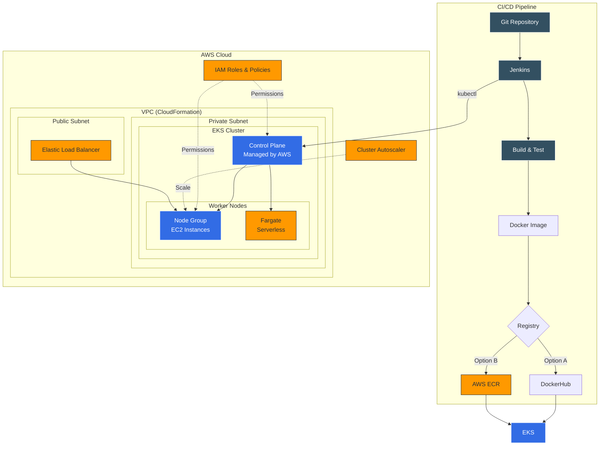

# Kubernetes on AWS (EKS)

Progressive EKS deployment: from manual cluster creation to full CI/CD pipeline with Jenkins, ECR and autoscaling.

> Part of the [DevOps Bootcamp by TechWorld with Nana](https://www.techworld-with-nana.com/devops-bootcamp) - Module 11

## Architecture Overview



## Progressive Learning Path

| Stage | Topic | Description |
|-------|-------|-------------|
| [01](./01-eks-cluster-manual/) | **EKS Cluster (Manual)** | Create EKS cluster via AWS Console: IAM roles, VPC with CloudFormation, Node Group |
| [02](./02-eks-autoscaling/) | **Cluster Autoscaling** | Deploy Cluster Autoscaler, test scaling with 20 nginx pods |
| [03](./03-eks-fargate/) | **EKS with Fargate** | Serverless worker nodes: Fargate profile, IAM role, deploy pods |
| [04](./04-eksctl/) | **eksctl** | Create EKS cluster with a single command using eksctl CLI |
| [05](./05-jenkins-eks-cicd/) | **Jenkins CI/CD to EKS** | Full pipeline: build, push to DockerHub/ECR, deploy to EKS |

## Quick Start

```bash
# Stage 1 — Manual EKS cluster (AWS Console)
# Follow docs in 01-eks-cluster-manual/

# Stage 4 — Quick cluster with eksctl
eksctl create cluster \
  --name my-cluster \
  --version 1.28 \
  --region eu-west-1 \
  --nodegroup-name worker-nodes \
  --node-type t3.medium \
  --nodes 2 \
  --nodes-min 1 \
  --nodes-max 3

# Connect kubectl
aws eks update-kubeconfig --name my-cluster --region eu-west-1

# Deploy an application
kubectl apply -f 05-jenkins-eks-cicd/kubernetes/
```

## What I Learned

- **EKS vs ECS**: EKS uses standard Kubernetes API (portable, large community, Helm charts), while ECS is AWS-specific but simpler for basic workloads
- **Worker Node options**: Self-managed EC2 → semi-managed Node Groups → fully-managed Fargate — each with different trade-offs between control and operational overhead
- **IAM is the glue**: Every AWS/K8s interaction requires IAM roles — EKS cluster role, Node Group role, Fargate role, autoscaler policy
- **VPC design matters**: EKS needs public + private subnets, proper security groups for Control Plane ↔ Worker Node communication
- **Cluster Autoscaler**: Not built into EKS — requires deploying a pod that watches for pending pods and scales Node Groups via AWS Auto Scaling Groups
- **Jenkins → EKS**: Requires kubectl + aws-iam-authenticator inside Jenkins container, plus kubeconfig and AWS credentials
- **ECR over DockerHub**: Better integration with EKS (same IAM, no rate limits, lower latency), but Docker secrets still needed for private DockerHub

## What I Would Change in Production

| Practice | Improvement |
|----------|-------------|
| **Cluster creation** | Use Terraform or Pulumi instead of manual/eksctl for reproducible infrastructure |
| **Secrets** | AWS Secrets Manager + External Secrets Operator instead of K8s Secrets |
| **CI/CD** | ArgoCD or Flux for GitOps instead of Jenkins push-based deployment |
| **Networking** | AWS Load Balancer Controller + Ingress instead of NodePort/LoadBalancer per service |
| **Monitoring** | Amazon CloudWatch Container Insights or Prometheus + Grafana stack |
| **Security** | Pod Security Standards, OPA/Kyverno policies, KMS encryption for etcd |
| **Node management** | Karpenter instead of Cluster Autoscaler for faster, smarter scaling |
| **Registry** | ECR image scanning enabled, lifecycle policies to clean old images |

## Related Projects

| Repository | Description |
|------------|-------------|
| [kubernetes-microservices](https://github.com/RustyHammer/kubernetes-microservices) | K8s deployment from raw manifests to Helm Charts and Helmfile |
| [devops-ci-cd-pipeline](https://github.com/RustyHammer/devops-ci-cd-pipeline) | CI/CD pipeline with Jenkins: build, containerize and deploy to EC2 |
| [aws-ec2-deployment](https://github.com/RustyHammer/aws-ec2-deployment) | Deploying containerized apps on AWS EC2 |
| [docker-compose-stacks](https://github.com/RustyHammer/docker-compose-stacks) | Ready-to-use Docker Compose stacks |
